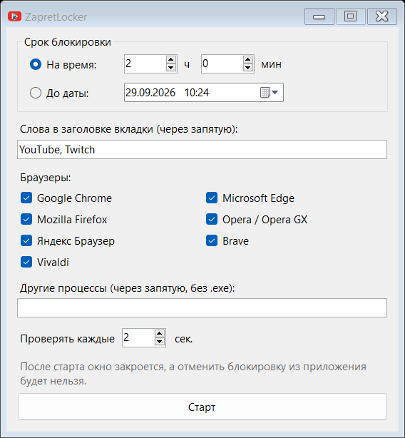

# ZapretLocker

Блокирует YouTube, Twitch и другие сайты на заданное время: вкладки с ними закрываются сами, пока срок не истечёт.

## Как пользоваться

1. Запустите `ZapretLocker.exe`.
2. Выберите срок: на сколько часов или до какой даты.
3. Укажите слова из названия вкладок и браузеры.
4. Нажмите «Старт».

Окно закроется, а блокировка будет работать до конца срока, в том числе после перезагрузки. Отменить её из приложения нельзя, можно только продлить. Когда срок выйдет, всё выключится само.

Работает на Windows.
